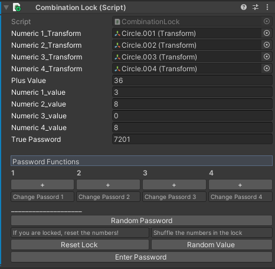
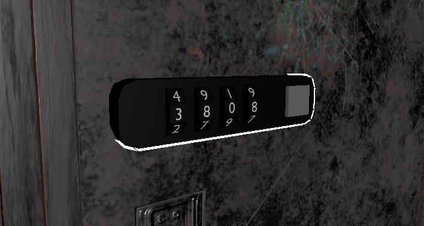

# Korku Oyunu Şifreli Kilit Sistemi

Merhaba sevgili bağlantılar,

Bu proje, Unity Editor sınıfını kullanarak geliştirdiğim korku oyunu için özel bir şifreli kilit sınıfını içermektedir. Bu sınıf, oyun içinde şifreli kilit mekanikleri üzerinde kontrol sağlama imkanı sunan kullanışlı bir araçtır.

### Inspector Paneli Görünümü

## Özellikler

- **Haneleri Arttırma:**
   - 1, 2, 3 ve 4 hanelerini teker teker Inspector panelindeki butonlar aracılığıyla arttırabilirsiniz.

- **Random Password Oluşturma:**
   - "Random Password" butonu ile rastgele bir şifre oluşturabilirsiniz.

- **Kilidi Sıfırlama:**
   - "Reset Lock" butonu ile kilidin üzerindeki numaraları sıfırlayabilirsiniz.

- **Rastgele Değer Atama:**
   - "Random Value" butonu ile kilidin üzerindeki değerleri rastgele olarak değiştirebilirsiniz.

- **Şifre Onaylama:**
   - "Enter Password" butonu ile kilidin üzerindeki şifreyi onaylayabilir ve doğru ya da yanlış olduğunu öğrenebilirsiniz.

## Motivasyon ve Notlar

Bu projede Unity Editor sınıfını kullanarak geliştirilmiş bir şifreli kilit sistemi bulunmaktadır. Projede gerçekleştirilen özellikler ve Editor sınıfı hakkındaki notlar için [bu bağlantıyı](https://lnkd.in/g9Yjp6E7) inceleyebilirsiniz.

## Proje Dosyaları

Bu çalışma, Unity Editor sınıfını kullanarak interaktif ve kullanıcı dostu bir şifreli kilit mekanizması geliştirmeyi amaçlamaktadır. Umarım projem, sizlere Editor sınıfı konusunda ilham verir ve kendi projelerinizde kullanabileceğiniz fikirler sunar.

İyi incelemeler!

### Projenin tanıtım videosu için [Bağlantıya Tıklayın <b>(Linkedin)</b>](https://www.linkedin.com/posts/mesut-atakan_merhaba-sevgili-ba%C4%9Flant%C4%B1lar%C4%B1m-bug%C3%BCn-korku-activity-7150813332843708416-kyIs?utm_source=share&utm_medium=member_desktop)

# Ekran Görüntüleri

### Şifreli Kilit Modeli

